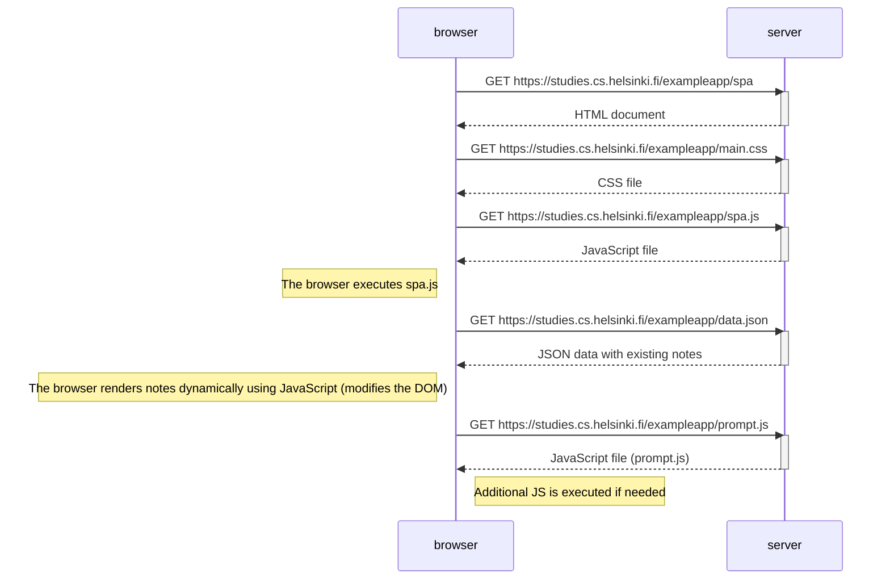

```mermaid
  sequenceDiagram
      participant browser
      participant server
  
      browser->>server: GET https://studies.cs.helsinki.fi/exampleapp/spa
      activate server
      server-->>browser: HTML document
      deactivate server
  
      browser->>server: GET https://studies.cs.helsinki.fi/exampleapp/main.css
      activate server
      server-->>browser: CSS file
      deactivate server
  
      browser->>server: GET https://studies.cs.helsinki.fi/exampleapp/spa.js
      activate server
      server-->>browser: JavaScript file
      deactivate server
  
      Note left of browser: The browser executes spa.js
  
      browser->>server: GET https://studies.cs.helsinki.fi/exampleapp/data.json
      activate server
      server-->>browser: JSON data with existing notes
      deactivate server
  
      Note left of browser: The browser renders notes dynamically using JavaScript (modifies the DOM)

    browser->>server: GET https://studies.cs.helsinki.fi/exampleapp/prompt.js
    activate server
    server-->>browser: JavaScript file (prompt.js)
    deactivate server
    Note right of browser: Additional JS is executed if needed
```
