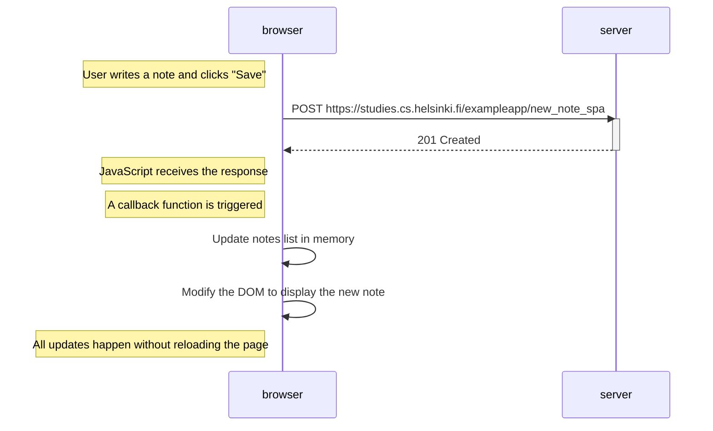

```mermaid
sequenceDiagram
    participant browser
    participant server

    Note left of browser: User writes a note and clicks "Save"

    browser->>server: POST https://studies.cs.helsinki.fi/exampleapp/new_note_spa
    activate server
    server-->>browser: 201 Created
    deactivate server

    Note left of browser: JavaScript receives the response
    Note left of browser: A callback function is triggered

    browser->>browser: Update notes list in memory
    browser->>browser: Modify the DOM to display the new note
    Note left of browser: All updates happen without reloading the page


``` 
